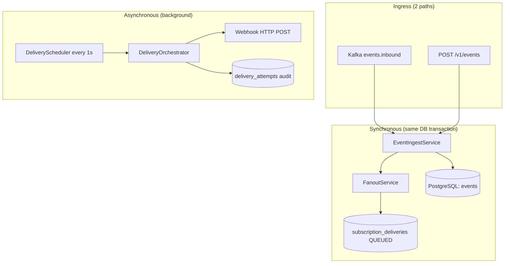
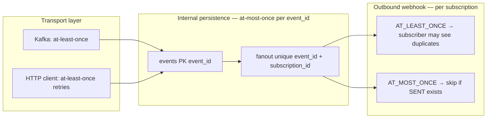
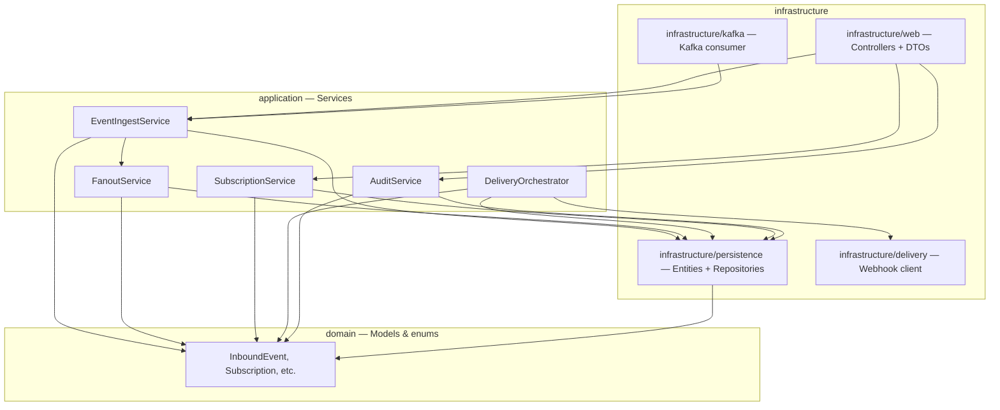

# Event-Driven Notification Fanout — Data Flow

This document describes how data moves through the service: ingress, consumer (subscription) matching, persistence, delivery, and audit. In this codebase, **consumers** are called **subscriptions** — each subscription defines a filter rule and a webhook target.

---

## System overview

| Component | Technology | Role |
|-----------|------------|------|
| **Database** | **PostgreSQL** (Spring Data JPA + Flyway) | All durable state |
| **Event ingress** | **Kafka** (`events.inbound`) or **HTTP** `POST /v1/events` | Both call the same `EventIngestService` |
| **Consumer matching (fanout)** | In-process, **synchronous** | Runs inside the ingest DB transaction |
| **Webhook delivery** | **Scheduled poller** (`@Scheduled`, default every **1s**) | Polls PostgreSQL — **not** Kafka-driven |



---

## PostgreSQL tables (entity mapping)

| Table | JPA entity | Purpose |
|-------|------------|---------|
| `events` | `EventEntity` | One row per accepted inbound event (canonical store) |
| `subscriptions` | `SubscriptionEntity` | Consumer definitions: filter, webhook target, retry policy |
| `subscription_delivery_cursors` | `SubscriptionDeliveryCursorEntity` | Per-subscription FIFO pointers (`next_assign_seq`, `next_deliverable_seq`) |
| `subscription_deliveries` | `SubscriptionDeliveryEntity` | One row per **(event, subscription)** match — delivery tracking unit |
| `delivery_attempts` | `DeliveryAttemptEntity` | **Delivery audit table** — immutable log of each HTTP attempt |

---

## How we find consumers (subscriptions) for an event

Consumers are **not** looked up by event type in a separate index. Matching is a **full scan of all active subscriptions** with filter evaluation:

1. **`FanoutService.fanout(event)`** loads active subscriptions from **`SubscriptionCache`**.
2. Cache is backed by PostgreSQL `subscriptions` where `enabled = true AND deleted = false`.
3. For **each** subscription, **`FilterEvaluator`** evaluates the subscription's JSON filter DSL against the event:
   - Composition: `all` (AND) / `any` (OR), nested groups supported
   - Fields: `type`, `source`, `payload.*` (dot-path into payload)
   - Operators: `eq`, `neq`, `in`, `not_in`, `exists`, `contains`, `gte`, `gt`, `lte`, `lt`
   - Null/missing filter → matches everything
4. Subscriptions whose filter returns `true` are **consumers for this event**.

This runs **synchronously** during ingest, in the **same database transaction** as persisting the event.

---

## What we store per consumer (subscription) when an event matches

When one event matches **N** subscriptions, we write **N delivery rows** — one per consumer — plus cursor updates.

### 1. Event (once, shared across all matches)

| Table | When | Key fields |
|-------|------|------------|
| `events` | First time this `event_id` is seen | `event_id`, `event_type`, `source`, `payload` (JSONB), `occurred_at`, `received_at`, `trace_id` |

Duplicate `event_id` → idempotent return of existing row; **no re-fanout**, no new delivery rows.

### 2. Per matching consumer (subscription)

| Table | Entity | When | Key fields |
|-------|--------|------|------------|
| `subscription_deliveries` | `SubscriptionDeliveryEntity` | One row per (event, subscription) match | `delivery_id`, `event_id`, `subscription_id`, `sequence_number`, `status` (`QUEUED`), `attempt_count` (0), timestamps |
| `subscription_delivery_cursors` | `SubscriptionDeliveryCursorEntity` | Updated on each match | `next_assign_seq` incremented; assigns FIFO `sequence_number` |

Unique constraints:

- `(event_id, subscription_id)` — at most one delivery per consumer per event
- `(subscription_id, sequence_number)` — strict FIFO ordering per subscription

### 3. Per HTTP delivery attempt (during dispatch, not at fanout)

| Table | Entity | When | Key fields |
|-------|--------|------|------------|
| `delivery_attempts` | `DeliveryAttemptEntity` | Each webhook HTTP try | `attempt_id`, `delivery_id`, `attempt_number`, `http_status`, `error_reason`, `status`, `started_at`, `finished_at`, `trace_id`, `span_id` |

The **delivery audit table** is **`delivery_attempts`**. Audit APIs join `subscription_deliveries` with `delivery_attempts` to build timelines.

---

## Cache vs database

| Operation | Cache | Database |
|-----------|-------|----------|
| **Fanout — load subscriptions** | `SubscriptionCache` (in-memory, TTL default **30s**) | Refreshed from `subscriptions` when cache is stale or empty |
| **Fanout — persist matches** | — | Writes `subscription_deliveries` + updates `subscription_delivery_cursors` |
| **Delivery dispatch — load subscription** | `SubscriptionCache.getById()` | Refreshed via same cache |
| **Delivery dispatch — load event** | — | Reads `events` by `event_id` |
| **Delivery dispatch — find work** | — | Polls `subscription_deliveries` (native query, head-of-line) |
| **Subscription CRUD APIs** | Cache **invalidated** on create/delete | Direct read/write to `subscriptions` |
| **Subscription list/get APIs** | — | Direct read from `subscriptions` |
| **Audit APIs** | — | Read-only queries on `subscription_deliveries` + `delivery_attempts` |

Cache invalidation: `SubscriptionService.create()` and `delete()` call `cache.invalidate()` so new/deleted consumers are picked up without restart (within TTL at worst, immediately if cache was empty).

---

## Retry policy: per consumer or global?

**Per consumer (per subscription).** Each subscription stores its own `retry_policy_json` in `subscriptions`:

```json
{
  "maxAttempts": 5,
  "initialBackoffMs": 1000,
  "maxBackoffMs": 60000,
  "multiplier": 2.0
}
```

At dispatch time, `DeliveryOrchestrator` loads the subscription from cache and uses **that subscription's** `RetryPolicy`:

- Backoff: `random(0, min(initial * multiplier^(attempt-1), maxBackoff))` (full jitter)
- Retry on: 5xx, 429, timeouts/connection errors
- No retry on: most 4xx → terminal `FAILED`
- When `attempt_count >= maxAttempts` → terminal `FAILED`

**Delivery mode** is also per subscription:

| Mode | Behavior |
|------|----------|
| `AT_LEAST_ONCE` | Retries until success or max attempts; duplicates possible |
| `AT_MOST_ONCE` | Skips dispatch if a prior `SENT` exists for same event + subscription |

There is **no global** retry configuration shared across all consumers.

---

## End-to-end ingest → deliver flow

```
Kafka message OR POST /v1/events
    │
    ▼
Validated (type, source, payload rules)
    │
    ▼
Duplicate check on events.event_id (PostgreSQL PK)
    │── duplicate → return existing, STOP
    │
    ▼
INSERT into events (PostgreSQL)
    │
    ▼
Fanout — SYNC, same transaction
    │── load all active subscriptions from SubscriptionCache (→ PostgreSQL)
    │── FilterEvaluator per subscription
    │── for each match:
    │       INSERT subscription_deliveries (status=QUEUED)
    │       bump subscription_delivery_cursors.next_assign_seq
    │
    ▼
Return 202 / Kafka ack
    │
    ║  (async boundary)
    ▼
DeliveryScheduler every DELIVERY_WORKER_POLL_MS (default 1s)
    │── poll subscription_deliveries at head-of-line
    │       (sequence_number = next_deliverable_seq)
    │
    ▼
DeliveryOrchestrator.dispatchDelivery()
    │── load subscription (cache) + event (DB)
    │── apply per-subscription retry policy + delivery mode
    │── HTTP POST webhook
    │── INSERT delivery_attempts (audit)
    │── update subscription_deliveries status
    │
    ▼
Audit APIs read subscription_deliveries + delivery_attempts
```

---

## Delivery state machine

```
QUEUED → IN_FLIGHT → SENT
                   → RETRY_PENDING → IN_FLIGHT → ...
                   → FAILED
```

FIFO: only the delivery at `next_deliverable_seq` is dispatched. If the head is in `RETRY_PENDING`, later sequences wait until the head reaches `SENT` or `FAILED`.

---

## Delivery guarantees: at-least-once vs at-most-once

Guarantees apply at **different layers**: transport (Kafka/HTTP), internal persistence (PostgreSQL), and webhook delivery (per-subscription `deliveryMode`). The table below maps each pipeline step to what the service actually promises.

### Summary table

| Step | At-least-once | At-most-once | How it is enforced |
|------|:-------------:|:------------:|---------------------|
| **Kafka message delivery** (broker → consumer) | ✓ | | Kafka redelivers if offset not committed |
| **Kafka offset commit** | | ✓ | Committed only after successful persist + fanout; invalid events acked after DLQ |
| **HTTP event ingest** (client → API) | ✓ | | Clients may retry; server deduplicates by `event_id` |
| **Event persist** (`events` table) | | ✓ | PK on `event_id`; duplicate ingest returns existing row |
| **Fanout / enqueue** (`subscription_deliveries`) | | ✓ | Same DB transaction as event insert; unique `(event_id, subscription_id)`; skipped on duplicate event |
| **Delivery scheduler poll** | ✓ | | Poller runs repeatedly; same row may be considered each tick until terminal |
| **Webhook HTTP dispatch** | Depends on subscription | Depends on subscription | Controlled by per-subscription `deliveryMode` (see below) |
| **Audit writes** (`delivery_attempts`) | ✓ | | One row appended per HTTP attempt (full history) |

### Per-step detail

#### 1. Event ingest (Kafka)

| Aspect | Guarantee |
|--------|-----------|
| **Message arrival** | **At-least-once** — Kafka may deliver the same record more than once if the consumer crashes before ack or if processing fails transiently. |
| **Offset commit** | **At-most-once commit per successful processing** — ack only after DB persist + fanout succeed. Transient failures leave the offset uncommitted → redelivery. |
| **Invalid events** | **At-most-once processing** — validation failures go to DLQ (`events.inbound.dlq`) and the offset is acked; the bad message is not retried on the main topic. |
| **Business outcome** | **At-most-once accept per `event_id`** — duplicate `event_id` is idempotent: existing row returned, fanout not re-run. |

#### 2. Event ingest (HTTP `POST /v1/events`)

| Aspect | Guarantee |
|--------|-----------|
| **Client retries** | **At-least-once** from the client’s perspective (network timeouts, 5xx retries). |
| **Business outcome** | **At-most-once accept per `event_id`** — same idempotency as Kafka path via `events.event_id` primary key. |

#### 3. Fanout (consumer matching + enqueue)

| Aspect | Guarantee |
|--------|-----------|
| **Delivery row creation** | **At-most-once per (event, subscription)** — enforced by unique constraint on `(event_id, subscription_id)` in `subscription_deliveries`. |
| **Transactional coupling** | Event insert + fanout + cursor updates share one transaction. Rollback on failure means no partial fanout; Kafka offset is not committed. |
| **Duplicate event ingest** | Fanout is **skipped** entirely when `event_id` already exists — no second `subscription_deliveries` row. |

#### 4. Delivery dispatch (scheduler → webhook)

| Aspect | Guarantee |
|--------|-----------|
| **Scheduler** | **At-least-once processing attempts** — `DeliveryScheduler` polls every `DELIVERY_WORKER_POLL_MS` (default 1s) until the delivery reaches a terminal state. |
| **Concurrency** | **At-most-one concurrent dispatch per delivery** — `findForUpdate` + `FOR UPDATE SKIP LOCKED` on the delivery row; terminal statuses (`SENT`, `FAILED`) are no-ops on re-poll. |
| **Webhook to subscriber** | **Per-subscription `deliveryMode`** — see next subsection. |

#### 5. Webhook delivery — per subscription `deliveryMode`

Configured on each subscription at create time (`deliveryMode` in `POST /v1/subscriptions`):

| Mode | Subscriber (webhook) guarantee | Service behavior |
|------|-------------------------------|------------------|
| **`AT_LEAST_ONCE`** | **At-least-once delivery** — the subscriber **may receive duplicates**. Retries on 5xx, 429, and connection/timeout errors until `SENT` or `maxAttempts` exhausted. | Multiple HTTP attempts recorded in `delivery_attempts`; each attempt gets a distinct `X-Idempotency-Key: {eventId}:{subscriptionId}:{attemptNumber}`. |
| **`AT_MOST_ONCE`** | **At-most-once successful delivery** — after a `SENT` row exists for the same `(event_id, subscription_id)`, further dispatch is skipped and the delivery is marked `FAILED` with reason `"Already delivered (AT_MOST_ONCE)"`. | Checked in `DeliveryOrchestrator` before HTTP POST via `existsByEventIdAndSubscriptionIdAndStatus(..., SENT)`. |

> **Important:** `AT_MOST_ONCE` prevents **redelivery after a recorded success** in this service. It does **not** protect against edge cases where the webhook returned 2xx but the process crashed before marking `SENT` — in that rare case a redispatch could still occur (inherently ambiguous without external deduplication on the subscriber side).

#### 6. Audit (`delivery_attempts`)

| Aspect | Guarantee |
|--------|-----------|
| **Attempt logging** | **At-least-once rows per HTTP try** — every dispatch attempt creates an append-only row in `delivery_attempts` (table name for delivery audit). |
| **Delivery tracking** | **At-most-one delivery record** per `(event_id, subscription_id)` in `subscription_deliveries`; status transitions are guarded by `DeliveryStateMachine`. |

### Idempotency keys (subscriber-side deduplication)

Subscribers can deduplicate using:

- Header: `X-Idempotency-Key: {eventId}:{subscriptionId}:{attemptNumber}`
- Body field: `idempotency_key` (same value)
- Stable event identity: `event_id` + `subscription_id` + `delivery_id`

Under **`AT_LEAST_ONCE`**, the same logical event may arrive with **different** `attemptNumber` values across retries — subscribers should treat `event_id` + `subscription_id` (or `delivery_id`) as the business idempotency key if they need exactly-once processing.

### Guarantee flow (diagram)



### What is NOT guaranteed

- **Exactly-once end-to-end** — not provided globally; closest behavior is at-most-once event accept + at-most-once enqueue, with webhook semantics chosen per subscription.
- **Stuck `IN_FLIGHT` deliveries** — if the process crashes after marking `IN_FLIGHT` but before completion, the scheduler only polls `QUEUED` and `RETRY_PENDING`; a stuck `IN_FLIGHT` row is not automatically recovered.
- **Subscription cache freshness** — fanout may use a subscription up to `SUBSCRIPTION_CACHE_TTL` seconds after soft-delete (worst case); DB is source of truth on cache refresh.

---

## Controller API flows

### `POST /v1/events` — Accept event (HTTP)

| Step | Detail |
|------|--------|
| Validation | `@Valid`: `type`, `source` non-blank; `payload` non-null; optional `event_id`, `occurred_at` |
| Service | `EventIngestService.acceptEvent(AcceptEventRequest)` |
| Duplicate check | `events.event_id` PK lookup |
| Persist | `events` table |
| Fanout | Sync — creates `subscription_deliveries` per match |
| Response | `202 Accepted` |
| Delivery | **Not** in this request — scheduler picks up `QUEUED` rows |

### Kafka ingest — `InboundEventKafkaConsumer`

| Step | Detail |
|------|--------|
| Topic | `events.inbound` (group: `fanout-ingest`, manual ack) |
| Validation | Stricter than HTTP: JSON parse, `payload` must be object |
| Pipeline | Same `persistAndFanout()` as HTTP |
| Invalid events | Sent to `events.inbound.dlq`, then acked |
| Transient errors | Offset **not** committed → retry |

### `POST /v1/subscriptions` — Create consumer

| Step | Detail |
|------|--------|
| Validation | `name`, `deliveryMode`, `filter`, `target` (URL), `retryPolicy` |
| Persist | `subscriptions` + init `subscription_delivery_cursors` |
| Cache | Invalidated |
| Response | `201 Created` |

### `GET /v1/subscriptions` / `GET /v1/subscriptions/{id}`

| Step | Detail |
|------|--------|
| Source | PostgreSQL `subscriptions` (read-only, no cache on list/get) |
| Response | Active subscription details |

### `DELETE /v1/subscriptions/{id}`

| Step | Detail |
|------|--------|
| Action | Soft delete: `deleted=true`, `enabled=false` |
| Cache | Invalidated |
| Note | Existing `subscription_deliveries` rows are **not** cancelled |

### Audit APIs

| Endpoint | Query |
|----------|-------|
| `GET /v1/audit/events/{eventId}` | `subscription_deliveries` by `event_id` + `delivery_attempts` per delivery |
| `GET /v1/audit/subscriptions/{id}?status=` | `subscription_deliveries` by `subscription_id` (+ optional status filter) + attempts |
| `GET /v1/audit/deliveries/{deliveryId}` | Single delivery + full attempt timeline from `delivery_attempts` |

All audit reads are **PostgreSQL only**, read-only transactions.

---

## Project structure — component paths

Base package: `src/main/java/com/eventdriven/notification/fanout/`

The codebase follows a layered layout: **domain** (pure models) → **application** (use cases / business logic) → **infrastructure** (adapters: REST, Kafka, JPA, HTTP).

```
src/main/java/com/eventdriven/notification/fanout/
├── EventDrivenNotificationFanoutApplication.java   # Spring Boot entry point
├── application/                                    # Use cases & business logic
├── domain/                                         # Core domain models & enums
├── infrastructure/                                 # External adapters
└── config/                                         # Spring configuration
```

### Controllers (REST API)

**Path:** `infrastructure/web/`

| File | API base path | Responsibility |
|------|---------------|----------------|
| `EventController.java` | `/v1/events` | HTTP event ingest (`POST`) |
| `SubscriptionController.java` | `/v1/subscriptions` | Subscription CRUD |
| `AuditController.java` | `/v1/audit` | Delivery audit queries |
| `GlobalExceptionHandler.java` | — | Maps exceptions to RFC 7807 `ProblemDetail` responses |

### DTOs (request / response objects)

**Path:** `infrastructure/web/dto/`

| File | Used by |
|------|---------|
| `AcceptEventRequest.java` | `POST /v1/events` request body |
| `AcceptEventResponse.java` | `POST /v1/events` response |
| `CreateSubscriptionRequest.java` | `POST /v1/subscriptions` request body |
| `SubscriptionResponse.java` | Subscription API responses |
| `DeliveryAuditResponse.java` | Audit API responses |

DTOs are REST-layer types only. They are mapped to/from **domain** objects inside application services.

### Application services (use cases)

**Path:** `application/`

| Sub-package | Key files | Responsibility |
|-------------|-----------|----------------|
| `application/ingest/` | `EventIngestService.java` | Validate, dedupe, persist events; trigger fanout |
| `application/fanout/` | `FanoutService.java` | Match subscriptions; enqueue `subscription_deliveries` |
| `application/subscription/` | `SubscriptionService.java`, `SubscriptionCache.java` | Subscription CRUD; in-memory subscription cache |
| `application/delivery/` | `DeliveryOrchestrator.java`, `DeliveryScheduler.java`, `DeliveryStateMachine.java` | Poll queue, dispatch webhooks, manage delivery states |
| `application/audit/` | `AuditService.java`, `DeliveryAuditView.java` | Read-only delivery history queries |
| `application/filter/` | `FilterEvaluator.java` | JSON filter DSL evaluation |
| `application/metrics/` | `FanoutMetrics.java` | Micrometer counters/timers |
| `application/logging/` | `StructuredLog.java`, `LogActions.java`, `LogStatus.java`, `MdcContext.java` | Structured logging helpers |
| `application/exception/` | `EventValidationException`, `ResourceNotFoundException`, `RetryableDeliveryException`, etc. | Application-layer exceptions |

### Domain models (no framework dependencies)

**Path:** `domain/`

| File | Purpose |
|------|---------|
| `InboundEvent.java` | Accepted inbound event |
| `Subscription.java` | Subscription (consumer) definition |
| `SubscriptionDelivery.java` | Delivery tracking unit |
| `DeliveryAttemptRecord.java` | Single HTTP attempt record |
| `WebhookTarget.java` | Webhook URL, headers, timeout |
| `RetryPolicy.java` | Per-subscription retry/backoff config |
| `DeliveryMode.java` | `AT_LEAST_ONCE` / `AT_MOST_ONCE` enum |
| `DeliveryStatus.java` | `QUEUED`, `IN_FLIGHT`, `SENT`, `RETRY_PENDING`, `FAILED` enum |

### JPA entities (database mapping)

**Path:** `infrastructure/persistence/entity/`

| File | PostgreSQL table |
|------|------------------|
| `EventEntity.java` | `events` |
| `SubscriptionEntity.java` | `subscriptions` |
| `SubscriptionDeliveryEntity.java` | `subscription_deliveries` |
| `SubscriptionDeliveryCursorEntity.java` | `subscription_delivery_cursors` |
| `DeliveryAttemptEntity.java` | `delivery_attempts` |

**Mapper:** `infrastructure/persistence/EntityMapper.java` — converts between JPA entities and domain models.

### Repositories (Spring Data JPA)

**Path:** `infrastructure/persistence/repository/`

| File | Entity | Primary operations |
|------|--------|-------------------|
| `EventJpaRepository.java` | `EventEntity` | Find/save events by `event_id` |
| `SubscriptionJpaRepository.java` | `SubscriptionEntity` | CRUD; `findAllActive()` |
| `SubscriptionDeliveryJpaRepository.java` | `SubscriptionDeliveryEntity` | Fanout inserts; `findReadyForDispatch()`; audit queries |
| `SubscriptionDeliveryCursorJpaRepository.java` | `SubscriptionDeliveryCursorEntity` | FIFO sequence assignment; head-of-line cursor |
| `DeliveryAttemptJpaRepository.java` | `DeliveryAttemptEntity` | Append audit rows; load attempt timeline |

### Kafka consumer

**Path:** `infrastructure/kafka/`

| File | Responsibility |
|------|----------------|
| `InboundEventKafkaConsumer.java` | Consumes `events.inbound`; delegates to `EventIngestService`; manual ack / DLQ |

Kafka Spring config: `config/KafkaConfig.java`

### Webhook HTTP client

**Path:** `infrastructure/delivery/`

| File | Responsibility |
|------|----------------|
| `WebhookDeliveryClient.java` | POST JSON envelope to subscriber webhook URL |
| `WebhookDeliveryResult.java` | HTTP status result wrapper |

### Configuration

**Path:** `config/`

| File | Responsibility |
|------|----------------|
| `FanoutProperties.java` | `@ConfigurationProperties` for `fanout.*` settings |
| `FanoutConfig.java` | Enables configuration properties |
| `KafkaConfig.java` | Kafka listener/producer beans |
| `JacksonConfig.java` | JSON serialization |
| `MetricsConfig.java` | Micrometer timers (e.g. `delivery.latency`) |

**Runtime config:** `src/main/resources/application.yml`

**DB migrations:** `src/main/resources/db/migration/` (Flyway SQL)

### Layer dependency flow



### Tests

**Path:** `src/test/java/com/eventdriven/notification/fanout/`

| File / package | Scope |
|----------------|-------|
| `FanoutIntegrationIT.java` | End-to-end with Testcontainers (PostgreSQL, Kafka) |
| `ControllerApiIT.java` | REST API integration tests |
| `application/filter/FilterEvaluatorTest.java` | Filter DSL unit tests |
| `application/delivery/DeliveryStateMachineTest.java` | State transition unit tests |
| `domain/RetryPolicyTest.java` | Backoff calculation unit tests |

---

## Configuration reference

| Variable | Default | Description |
|----------|---------|-------------|
| `KAFKA_INBOUND_TOPIC` | `events.inbound` | Event ingress topic |
| `KAFKA_DLQ_TOPIC` | `events.inbound.dlq` | Invalid event dead-letter |
| `DELIVERY_WORKER_POLL_MS` | `1000` | Delivery scheduler interval (ms) |
| `SUBSCRIPTION_CACHE_TTL` | `30` | Subscription cache TTL (seconds) |
| `DB_*` | see `application.yml` | PostgreSQL connection |

> **Note:** `deliveries.pending` appears in config but is **not used** in code. Delivery is driven by polling `subscription_deliveries`, not a Kafka delivery topic.
